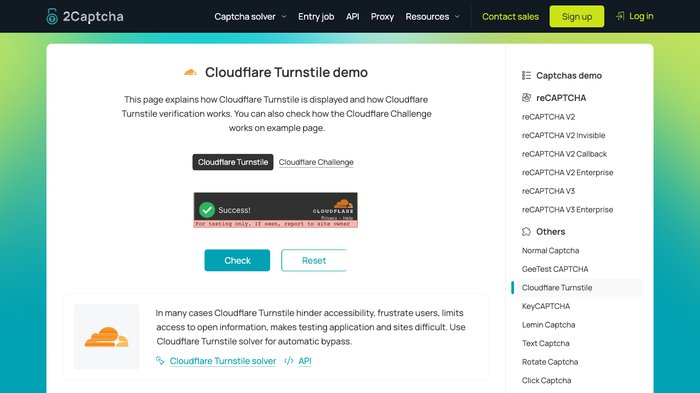
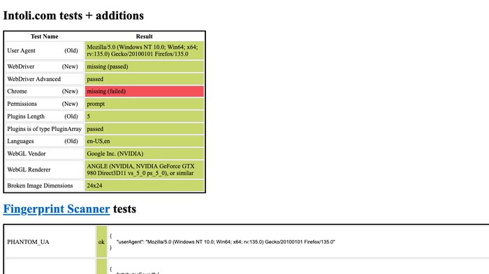

<div align="center">


# MCP Camoufox


</div>

The most feature-rich stealth browser MCP server. **133 tools** for full browser control powered by [Camoufox](https://github.com/daijro/camoufox) — a Firefox fork with C++ level anti-detection that bypasses Cloudflare, bot detection, and anti-automation.

> **One command. No Python. No manual setup. Everything auto-installs.**

```bash
claude mcp add camoufox -- npx -y mcp-camoufox@latest
```

## What Can It Do?

- Login to Google, ChatGPT, GitHub — without getting blocked
- Fill forms, click buttons, type text, upload files
- Manage cookies, localStorage, sessions across visits
- Take screenshots, export PDFs, capture network traffic
- Work with multiple tabs, iframes, dialogs
- Execute JavaScript, inspect elements, scroll pages
- Scrape structured data (job listings, products) with auto-detected selectors
- All while being **undetectable** by anti-bot systems

## Comparison


| MCP Server                                                      | Tools   | Stealth | npx Install | Persistent Session |
| --------------------------------------------------------------- | ------- | ------- | ----------- | ------------------ |
| Chrome DevTools MCP                                             | 30+     | No      | Built-in    | Yes                |
| whit3rabbit/camoufox-mcp                                        | 1       | Yes     | Yes         | No                 |
| redf0x1/camofox-mcp                                             | 47      | Yes     | Yes         | Yes                |
| Sekinal/camoufox-mcp                                            | 49      | Yes     | No (clone)  | Yes                |
| Playwright CLI                                                  | 60+     | No      | Yes         | Yes                |
| [**mcp-camoufox**](https://github.com/RobithYusuf/mcp-camoufox) | **133** | **Yes** | **Yes**     | **Yes**            |

<sub>Competitor figures checked 19 Aug 2026: camofox-mcp counted by running `tools/list` against v1.15.0 from npm (it is npx-installable — an earlier version of this table wrongly said otherwise); the others are taken from their own READMEs.</sub>


## Proven on Real Sites


| Site                                     | Challenge                   | Result                                                                             |
| ---------------------------------------- | --------------------------- | ---------------------------------------------------------------------------------- |
| `2captcha.com/demo/cloudflare-turnstile` | Cloudflare Turnstile widget | ✅ **"Success!"** via `click_turnstile()` tool ([proof](docs/images/turnstile.jpg)) |
| `bot.sannysoft.com`                      | Firefox fingerprint tests   | ✅ All green ([proof](docs/images/sannysoft.jpg))                                   |
| `browserscan.net/bot-detection`          | WebDriver/UA/CDP/Navigator  | ✅ All categories "Normal" ([proof](docs/images/browserscan.jpg))                   |


### 🎯 Cloudflare Turnstile → Success via `click_turnstile()`



`click_turnstile()` auto-detects the widget via 6 selector fallback (`iframe[src*=challenges.cloudflare.com]`, `[data-sitekey]`, `.cf-turnstile`, …), computes checkbox position (offset_x=30 from widget left), and clicks with a 3-step Bezier-like approach — combined with Camoufox's native `humanize` + `disable_coop` for cross-origin iframe click.

**Scope:** works on **Interactive Turnstile** (visible iframe widget). **Managed Challenge** interstitials ("Just a moment...") render the widget in shadow DOM — not supported here; use sister project [mcp-stealth-chrome](https://github.com/RobithYusuf/mcp-stealth-chrome) (Chrome+CDP) for those. Real-world bypass success also depends on IP reputation and browser fingerprint — code alone doesn't guarantee it.

### 🧪 bot.sannysoft.com → Firefox Fingerprint Pass



User Agent reports `Firefox/135.0`, WebDriver missing, WebDriver Advanced passed, Permissions prompt, Plugins length 5 passed, Languages `en-US,en`, WebGL Intel HD Graphics — all green. ("Chrome: missing" is expected — Camoufox spoofs Firefox, not Chrome.)

### 🔍 browserscan.net/bot-detection → All Categories Normal


WebDriver, User-Agent, CDP, Navigator — every detection category returns **"Normal"**. Camoufox's C++-level Firefox patches leave zero automation signals.

## Setup

One command for Claude Code:

```bash
claude mcp add camoufox -- npx -y mcp-camoufox@latest
```

Every other client takes the same server block — only the config file differs:

```json
{
  "mcpServers": {
    "camoufox": {
      "command": "npx",
      "args": ["-y", "mcp-camoufox@latest"]
    }
  }
}
```

| Client | Config file |
| --- | --- |
| Claude Code | `claude mcp add camoufox --scope user -- npx -y mcp-camoufox@latest` (drop `--scope user` for project-only) |
| Claude Desktop | macOS `~/Library/Application Support/Claude/claude_desktop_config.json` · Windows `%APPDATA%\Claude\claude_desktop_config.json` · Linux `~/.config/Claude/claude_desktop_config.json` |
| Cursor | `~/.cursor/mcp.json` (global) or `.cursor/mcp.json` (project) |
| Windsurf | `~/.windsurf/mcp.json` or `.windsurf/mcp.json` — uses `"servers"` instead of `"mcpServers"` |
| VS Code (Continue / Cline / Kilo) | `~/.continue/config.json` or `.vscode/mcp.json` |
| Factory (Droid) | `~/.factory/mcp.json` or `.factory/mcp.json`, with `"type": "stdio"` — or `droid mcp add camoufox "npx -y mcp-camoufox@latest"` |
| Antigravity | `~/.gemini/antigravity/mcp_config.json` (global only) |

Two clients need a different shape:

```jsonc
// OpenCode — ~/.config/opencode/opencode.json ("local", not "stdio"; command is one array)
{ "mcp": { "camoufox": { "type": "local", "command": ["npx", "-y", "mcp-camoufox@latest"], "enabled": true } } }

// Trae — ~/.trae/mcp.json (mcpServers is an ARRAY)
{ "mcpServers": [ { "name": "camoufox", "command": ["npx", "-y", "mcp-camoufox@latest"] } ] }
```

### Requirements

**Node.js 18+ is the only prerequisite** (`node --version`). The Camoufox browser binary (~80 MB)
downloads itself on first launch — nothing else to install.

On **Windows** the same one-liner works; there is no standalone `.exe` because this is a Node package.
The browser lands in `%LOCALAPPDATA%\camoufox`, profile/screenshots/sessions in
`%USERPROFILE%\.camoufox-mcp\`, and output paths accept either `C:\path\file.json` or `C:/path/file.json`.

| Requirement | Version | Check            |
| ----------- | ------- | ---------------- |
| **Node.js** | 18+     | `node --version` |


That's all. Camoufox browser binary (~80MB) downloads automatically on first launch.

## All 133 Tools

### Browser Lifecycle (4)


| Tool              | Description                                                                                                                                                                                                                                                                                                                                                                                                     |
| ----------------- | --------------------------------------------------------------------------------------------------------------------------------------------------------------------------------------------------------------------------------------------------------------------------------------------------------------------------------------------------------------------------------------------------------------- |
| `browser_launch`  | Launch stealth browser. Options: `url`, `headless`, `humanize`, `geoip`, `locale`, `width`, `height`, `fresh_profile`, `no_viewport`. `**width`/`height` size the WINDOW** — the viewport is ~80px shorter because of browser chrome; the launch reply now prints viewport/window/screen so there's no guessing. If a browser is already running these options are ignored — `browser_close` first to relaunch. |
| `browser_close`   | Close browser. Reports exactly what survived — e.g. *"3 persisted, 1 session-only (dropped)"* — so a lost login is never a mystery. Temp profile removed if `fresh_profile` was used.                                                                                                                                                                                                                           |
| `reset_profile`   | Wipe the persistent profile at `~/.camoufox-mcp/profile` (browser must be closed first)                                                                                                                                                                                                                                                                                                                         |
| `browser_recover` | Escape hatch when the browser is wedged and `browser_close` can't finish: force-drops the connection, resets state, and reports a profile lock held by another Camoufox                                                                                                                                                                                                                                         |


### Navigation (4)


| Tool         | Description                                                                     |
| ------------ | ------------------------------------------------------------------------------- |
| `navigate`   | Go to URL. Options: `wait_until` (domcontentloaded/load/networkidle), `timeout` |
| `go_back`    | Back in history                                                                 |
| `go_forward` | Forward in history                                                              |
| `reload`     | Reload page                                                                     |


### DOM &amp; Content (7)


| Tool               | Description                                                                                                                                                                                                           |
| ------------------ | --------------------------------------------------------------------------------------------------------------------------------------------------------------------------------------------------------------------- |
| `browser_snapshot` | Get interactive elements with ref IDs. **Call after every navigation.** On large pages narrow with `roles=["button","textbox"]` or paginate with `offset`/`limit` — refs stay stable.                                 |
| `screenshot`       | Capture viewport, full page, or **one element** (`ref` / `selector` — perfect for documenting a modal). Returns the **image inline** plus the saved path, so no second read step. `return_image=false` for path only. |
| `get_text`         | Text from page or selector (max 5000 chars)                                                                                                                                                                           |
| `get_html`         | HTML from page or selector (max 10000 chars)                                                                                                                                                                          |
| `get_url`          | Current URL + title                                                                                                                                                                                                   |
| `save_pdf`         | ⚠️ Not available on Camoufox — Playwright implements PDF generation only for headless Chromium, and Camoufox is Firefox. Returns a clear error; use `screenshot(full_page=true)` instead.                             |
| `search_page`      | Grep the current page's visible text with surrounding context — costs nothing next to a snapshot or screenshot                                                                                                        |


### Element Interaction (12)


| Tool                   | Description                                                                                                                                                                                                                                                         |
| ---------------------- | ------------------------------------------------------------------------------------------------------------------------------------------------------------------------------------------------------------------------------------------------------------------- |
| `click`                | Click by ref ID. Options: `button`, `dblclick`. If the real mouse click is blocked, it falls back to a full synthetic pointer sequence (`pointerdown`→`mousedown`→`pointerup`→`mouseup`→click) **and says so** — a degraded click is never reported as a clean one. |
| `click_text`           | Click by visible text. **Refuses to guess:** several matches → fails with a numbered candidate list (tag, text, ancestor path, ref). Narrow with `within` (`"@dialog"`, a CSS selector, or `"ref:e5"`) or choose with `index`.                                      |
| `click_role`           | Click by ARIA role + name. Same `within` / `index` / ambiguity guard as `click_text`.                                                                                                                                                                               |
| `hover`                | Hover over element                                                                                                                                                                                                                                                  |
| `fill`                 | Fill input/textarea — always **replaces** the old value (`email`/`number` inputs are cleared explicitly first; Firefox's select-all is a no-op on those, which otherwise made a re-fill append)                                                                     |
| `select_option`        | Select from dropdown                                                                                                                                                                                                                                                |
| `check` / `uncheck`    | Toggle checkbox/radio                                                                                                                                                                                                                                               |
| `upload_file`          | Upload file to input                                                                                                                                                                                                                                                |
| `click_element_offset` | Click at an x%/y% position inside an element — wide labels whose real checkbox sits at the left edge, sliders, split buttons                                                                                                                                        |
| `click_at_corner`      | Click a corner (close/X, delete, dismiss controls live there, not in the centre)                                                                                                                                                                                    |
| `paste_text`           | Fill via a **real** clipboard paste (Ctrl/Cmd+V) so frameworks that only listen for `paste` — Svelte 5 / Solid runes, some Qwik forms — actually receive it                                                                                                         |


### Keyboard (2)


| Tool        | Description                                                                |
| ----------- | -------------------------------------------------------------------------- |
| `type_text` | Type char by char. Options: `delay`. For OTP, masked inputs, date pickers. |
| `press_key` | Key or combo: `Enter`, `Escape`, `Tab`, `Control+a`, `Meta+c`              |


### Mouse XY (4)


| Tool              | Description                                                                                                                                                                                                                 |
| ----------------- | --------------------------------------------------------------------------------------------------------------------------------------------------------------------------------------------------------------------------- |
| `mouse_click_xy`  | Click at exact coordinates. Optional `steps` (0=instant, 15-30=human-like pre-movement)                                                                                                                                     |
| `mouse_move`      | Move cursor to coordinates. Optional `steps` for interpolated path                                                                                                                                                          |
| `click_turnstile` | Auto-find + humanized click on Cloudflare Turnstile widget. Params: `offset_x` (default 30), `offset_y`, `wait_render_ms`. Works on Interactive Turnstile (visible iframe widget). Not for Managed Challenge interstitials. |
| `drag_and_drop`   | Drag between two elements                                                                                                                                                                                                   |


### Wait (7)


| Tool                  | Description                                                                                                                                                                   |
| --------------------- | ----------------------------------------------------------------------------------------------------------------------------------------------------------------------------- |
| `wait_for`            | Wait for selector or text (visible/hidden/attached/detached)                                                                                                                  |
| `wait_for_navigation` | Wait for page load                                                                                                                                                            |
| `wait_for_url`        | Wait for URL pattern match. Wrap in `/…/` for regex; a bare `/path` is treated as a substring.                                                                                |
| `wait_for_response`   | Wait for network response pattern                                                                                                                                             |
| `wait_for_change`     | Wait until the page actually CHANGES and report what changed (url/title/DOM size/text) — the honest replacement for a fixed sleep after a click                               |
| `wait_for_request`    | Block until the page ISSUES a matching request — confirms an action really fired its API call                                                                                 |
| `wait_for_any_of`     | Race several conditions (`selector`/`text`/`url_contains`/`title_contains`) — returns the first that matches so the agent can branch in one call. Ideal for post-login flows. |


### Tabs (4)


| Tool         | Description                                                                                                                                                             |
| ------------ | ----------------------------------------------------------------------------------------------------------------------------------------------------------------------- |
| `tab_list`   | List all tabs. Pages the site opens itself (`window.open` / `target=_blank`, e.g. OAuth popups) are auto-tracked and appear here too.                                   |
| `tab_new`    | Open new tab                                                                                                                                                            |
| `tab_select` | Switch tab by `index` or `url_contains` (first tab whose URL matches)                                                                                                   |
| `tab_close`  | Close tab by `index` (-1 = active) or `url_contains`. The active tab is tracked by identity, so closing a lower-indexed tab never silently switches you to another one. |


### Cookies (3)


| Tool            | Description                                                                                                                                                                                                 |
| --------------- | ----------------------------------------------------------------------------------------------------------------------------------------------------------------------------------------------------------- |
| `cookie_list`   | List cookies. Options: `domain` filter                                                                                                                                                                      |
| `cookie_set`    | Set cookie with `expires_days`, `http_only`, `secure`, `same_site`. `**expires_days=0` (default) makes a session cookie that dies at `browser_close`** — pass a lifetime to keep a login across relaunches. |
| `cookie_delete` | Delete by name/domain. Empty = clear all.                                                                                                                                                                   |


### Local Storage (3)


| Tool                 | Description             |
| -------------------- | ----------------------- |
| `localstorage_get`   | Get all or specific key |
| `localstorage_set`   | Set key-value           |
| `localstorage_clear` | Clear all               |


### Session Storage (3)


| Tool                   | Description                                                                |
| ---------------------- | -------------------------------------------------------------------------- |
| `sessionstorage_get`   | Get all or specific key                                                    |
| `sessionstorage_set`   | Set key-value                                                              |
| `sessionstorage_clear` | Clear all sessionStorage for the origin (parity with `localstorage_clear`) |


### JavaScript (2)


| Tool                 | Description                                |
| -------------------- | ------------------------------------------ |
| `evaluate`           | Run JS in page context                     |
| `inject_init_script` | Inject script that runs on every page load |


### Element Inspection (5)


| Tool                 | Description                                                                                                                                 |
| -------------------- | ------------------------------------------------------------------------------------------------------------------------------------------- |
| `inspect_element`    | Full element info: tag, attributes, box, styles                                                                                             |
| `get_attribute`      | Get specific attribute                                                                                                                      |
| `query_selector_all` | Query multiple elements by CSS selector                                                                                                     |
| `get_links`          | Get all links with URL + text. Options: `filter`                                                                                            |
| `form_introspect`    | Whole-form analysis in one call: label, type, value, required/pattern/length, validation state, and the JS framework each field is bound to |


### Frames (2)


| Tool             | Description             |
| ---------------- | ----------------------- |
| `list_frames`    | List all frames/iframes |
| `frame_evaluate` | Run JS inside a frame   |


### Batch Operations (6)


| Tool                    | Description                                                                                                                                                                           |
| ----------------------- | ------------------------------------------------------------------------------------------------------------------------------------------------------------------------------------- |
| `batch_actions`         | Multiple actions in one call (click, fill, type, press, wait)                                                                                                                         |
| `fill_form`             | Fill multiple fields + optional submit                                                                                                                                                |
| `login_classic`         | Composite login for email→password forms (Google/Microsoft/generic). Auto email→Next→password→submit, optional TOTP 2FA (`totp_secret` or `totp_code`). Collapses 5–8 calls into one. |
| `navigate_and_snapshot` | Navigate + snapshot in one call                                                                                                                                                       |
| `smart_fill`            | Fill fields by **label text** (fuzzy) instead of refs — no snapshot needed; optional `submit_label`                                                                                   |
| `workflow_run`          | Run a list of tool calls in sequence; resumable via `start_at` after a failure                                                                                                        |


### Viewport (2)


| Tool                | Description                                                                  |
| ------------------- | ---------------------------------------------------------------------------- |
| `get_viewport_size` | Get width x height                                                           |
| `set_viewport_size` | Set an EXACT viewport after launch — the precise way to control content size |


### Scroll (2)


| Tool        | Description                                                               |
| ----------- | ------------------------------------------------------------------------- |
| `scroll`    | Scroll up/down/left/right by pixel amount                                 |
| `scroll_to` | Scroll a specific element into view (`ref`/`selector`, `block` alignment) |


### Dialog (2)


| Tool                 | Description                                                                                                      |
| -------------------- | ---------------------------------------------------------------------------------------------------------------- |
| `dialog_handle`      | Pre-set accept/dismiss for the next alert/confirm/prompt on **any** open tab (first dialog wins, then disarms)   |
| `dialog_auto_handle` | PERSISTENT handler — stays armed across every dialog and every tab, including popups. `enabled=false` removes it |


### Accessibility (1)


| Tool                     | Description                              |
| ------------------------ | ---------------------------------------- |
| `accessibility_snapshot` | Accessibility tree for LLM understanding |


### Console &amp; Network (9)


| Tool                            | Description                                                                                                                                                                                                                                          |
| ------------------------------- | ---------------------------------------------------------------------------------------------------------------------------------------------------------------------------------------------------------------------------------------------------- |
| `console_start` / `console_get` | Capture and retrieve browser console messages. Capture spans **all tabs** and follows newly opened tabs/popups (re-calling `console_start` resets cleanly — no listener stacking).                                                                   |
| `network_start` / `network_get` | Capture network requests across **all tabs** (follows tab switches + popups). `network_start(capture_bodies=true)` also records request/response headers + text bodies. `network_get(filter=...)` narrows by URL substring; each row shows an `#id`. |
| `network_get_detail`            | Full request + response (headers + text body) for one captured request by `#id` or `url` substring. Needs `capture_bodies=true`. Replaces the `evaluate()`+`fetch()` workaround for inspecting API payloads.                                         |
| `intercept_start` / `intercept_stop` | Abort requests before they leave the browser, by resource type (`image`, `media`, `font`, `stylesheet`, `script`, `xhr`, `fetch`, `websocket`) and/or URL pattern (`*doubleclick.net*`). Blocking images and stylesheets removes most of a typical page's bytes — the biggest single speed-up for scraping. Routed on the **context**, so tabs opened later are covered too. `document` cannot be blocked: that would abort the navigation itself. |
| `intercept_log`                 | What interception actually blocked and allowed, with the rule that matched each decision — so a "blocked" claim can be checked rather than trusted.                                                                                                 |
| `export_curl`                   | Rebuild a captured request as a runnable `curl` command (method, headers, body) to replay or share an API call. Needs `capture_bodies=true`. Warns when the command carries live credentials; `redact=true` produces a shareable version.           |


### Compound (reduce round-trips) (4)


| Tool                  | Description                                                                  |
| --------------------- | ---------------------------------------------------------------------------- |
| `wait_and_snapshot`   | Wait for selector/text + return snapshot in one call                         |
| `back_and_snapshot`   | Navigate back + return snapshot                                              |
| `reload_and_snapshot` | Reload page + return snapshot                                                |
| `click_and_snapshot`  | Click + wait + return snapshot. Perfect for buttons that trigger navigation. |


### Smart Selectors (skip snapshot) (3)


| Tool                  | Description                                                                                                                                                            |
| --------------------- | ---------------------------------------------------------------------------------------------------------------------------------------------------------------------- |
| `find_by_text`        | Find by visible text — returns **every** match with a ref, ancestor path and total, so you can see whether the one you'd click is the one you mean. Supports `within`. |
| `find_by_label`       | Find input by label text, returns ref (lists all candidates if several match). Supports `within`.                                                                      |
| `find_by_placeholder` | Find input by placeholder, returns ref (lists all candidates if several match). Supports `within`.                                                                     |


### Session Portability (7)


| Tool                 | Description                                                                                   |
| -------------------- | --------------------------------------------------------------------------------------------- |
| `cookie_export`      | Export all cookies as JSON (for transfer)                                                     |
| `cookie_import`      | Import cookies from JSON (restore session)                                                    |
| `cookie_export_file` | Write all cookies to a JSON file (Playwright format)                                          |
| `cookie_import_file` | Load cookies from a JSON file (Playwright format)                                             |
| `storage_state_save` | Save cookies + localStorage + sessionStorage to JSON file. Reload to skip login/CF.           |
| `storage_state_load` | Restore session from JSON (cookies + storage). Use `navigate_to` param to apply localStorage. |
| `auth_capture`       | Convenience: save current session to `~/.camoufox-mcp/sessions/<name>.json`                   |


### Humanize / Anti-Bot (5)


| Tool                            | Description                                                                                                                                                                     |
| ------------------------------- | ------------------------------------------------------------------------------------------------------------------------------------------------------------------------------- |
| `humanize_click`                | 3-step Bezier mouse approach + small jitter before click. Scrolls the target into view first (a real mouse click can't reach an off-screen element). Use for CF/DataDome pages. |
| `humanize_type`                 | Gaussian-distributed keystroke delays (mean 80ms, sigma 30ms). Mimics human rhythm.                                                                                             |
| `mouse_drift`                   | Random mouse movements over duration — builds mouse history before action.                                                                                                      |
| `mouse_record` / `mouse_replay` | Capture human mouse path then replay (anti-bot gold).                                                                                                                           |


### Session Warmup &amp; Detection (2)


| Tool              | Description                                                                        |
| ----------------- | ---------------------------------------------------------------------------------- |
| `session_warmup`  | Visit Google/Wikipedia (random) before targeting protected site. Helps IP scoring. |
| `detect_anti_bot` | Heuristic detection of CF/DataDome/Akamai/PerimeterX/Imperva/reCAPTCHA/hCaptcha.   |


### Assertions (4)


| Tool                     | Description                                                                                       |
| ------------------------ | ------------------------------------------------------------------------------------------------- |
| `assert_element_visible` | PASS/FAIL — element exists and is visible                                                         |
| `assert_text_present`    | PASS/FAIL — text substring on page                                                                |
| `assert_url_matches`     | PASS/FAIL — URL matches pattern (substring or regex)                                              |
| `assert_clickable`       | Hit-test **without clicking**: would a real click land? Names the element that would intercept it |


### Workflow Helpers (3)


| Tool                    | Description                                                                                                                                                                          |
| ----------------------- | ------------------------------------------------------------------------------------------------------------------------------------------------------------------------------------ |
| `click_and_wait`        | Click + wait for navigation/selector atomically (fewer roundtrips)                                                                                                                   |
| `wait_for_network_idle` | Wait until there are zero in-flight requests for `idle_ms` continuously (tracked per request — the threshold really is yours, not Playwright's fixed 500 ms)                         |
| `describe_page`         | Compact LLM-friendly summary (title, h1, buttons, links, forms) + `intent` classifier (`login_email`, `otp_input`, `captcha`, `stay_signed_in`, …) — cheaper than `browser_snapshot` |


### Scraping &amp; Extraction (4)


| Tool                     | Description                                                                                                                      |
| ------------------------ | -------------------------------------------------------------------------------------------------------------------------------- |
| `detect_content_pattern` | Auto-detect repeated content (cards, listings) and suggest CSS selectors. **Run this before `extract_structured`.**              |
| `extract_structured`     | Extract data from repeated elements as clean JSON. Auto-deduplicates, filters empties, `direct_text_only` prevents field mixing. |
| `extract_table`          | Extract HTML table as JSON array with auto-detected headers                                                                      |
| `scrape_page`            | Smart scraper: auto-extract main content (strips nav/footer), links, meta, headings. Smart truncation at paragraph boundary.     |


### Browserless HTTP (5)

The browser is the expensive path. `impit` (already shipped with camoufox-js) speaks a real **Firefox** TLS/HTTP2 fingerprint, so these tools fetch without launching anything — and the fingerprint matches the browser this server actually drives. Verified against a Cloudflare-protected site that these tools cleared **without opening a browser at all**.

> No SERP scraping here by design: scraping a search page without an API returns confidently wrong results for whole classes of query (Bing answers any "how does …" question with dictionary pages) and one major engine is TLS-blocked by some ISPs. `search` exists instead — it talks to a real search API you control, which has no such failure mode. Feed its URLs to `scrape_markdown` to read the sources.


| Tool                   | Description                                                                                                                                                |
| ---------------------- | ---------------------------------------------------------------------------------------------------------------------------------------------------------- |
| `http_request`         | HTTP with a real Firefox TLS fingerprint, reusing the live browser's cookies by default — log in with the browser, then hit the site's API cheaply         |
| `http_session_cookies` | Show which browser cookies would be sent to a URL (verify session sharing before relying on it)                                                            |
| `scrape_markdown`      | One URL → clean LLM-ready markdown (headings/links/lists kept, nav/footer/scripts stripped). Browserless by default, `use_browser=true` for JS-heavy pages |
| `smart_fetch`          | Tries HTTP first, escalates to the stealth browser **only** when the response looks anti-bot blocked. The efficiency core                                  |
| `search` | Search through an API **you** control — self-hosted SearXNG, or Brave/Tavily/Exa with a key — returning a normalised title/url/snippet list. Set `MCP_SEARCH_ENDPOINT` once. Never scrapes a result page. |


### Storage Inspection (4)


| Tool               | Description                                                                                    |
| ------------------ | ---------------------------------------------------------------------------------------------- |
| `storage_snapshot` | Capture cookies + localStorage + sessionStorage into a named slot                              |
| `storage_diff`     | Diff current state against that slot — the fastest way to find which key holds a session token |
| `indexeddb_list`   | List IndexedDB databases for the origin (where many SPAs hide auth state)                      |
| `indexeddb_delete` | Delete an IndexedDB database by name                                                           |


### Debug (5)


| Tool                   | Description                                                                                                                                                              |
| ---------------------- | ------------------------------------------------------------------------------------------------------------------------------------------------------------------------ |
| `server_status`        | Health check: browser status, tabs, URL                                                                                                                                  |
| `get_page_errors`      | Uncaught JS errors + unhandled promise rejections, captured by a hook installed at `browser_launch`. Buffer resets on every navigation — read it before navigating away. |
| `export_har`           | Export captured traffic as a valid **HAR 1.2** file (opens in DevTools). Needs `network_start` first; headers/bodies included only with `capture_bodies=true`.           |
| `page_stats`           | Element count, page size, load metrics + extraction strategy recommendation                                                                                              |
| `performance_timeline` | TTFB, DOMContentLoaded, load, FCP, LCP + the 5 slowest resources (CLS is unavailable — Firefox has no layout-shift API)                                                  |
| `fingerprint_audit`    | The fingerprint a site actually sees (user-agent, platform, languages, timezone, screen vs window, cores, WebGL, `navigator.webdriver`), and flags **contradictions between those values** — a viewport larger than the screen, a Chrome object on a Firefox UA, a platform that disagrees with the user-agent. Self-consistency only: it cannot tell you whether a given site's detector passes you. |


### Site Automation (2)


| Tool                     | Description                                                                                                                                                                                                                  |
| ------------------------ | ---------------------------------------------------------------------------------------------------------------------------------------------------------------------------------------------------------------------------- |
| `chatgpt_generate_image` | End-to-end image generation/edit on chatgpt.com in one call: fresh chat → optional reference-image upload → prompt → wait for the finished image → save PNG to `output_path`. Requires an authenticated chatgpt.com session. |
| `chatgpt_generate_batch` | Many images in parallel (one tab per job, submit-all-then-collect). `shared_image_paths` + `style_suffix` keep a set visually consistent.                                                                                    |


## Examples

**Read a page without launching anything.** The browser costs seconds and ~400 MB; most fetches don't
need a DOM. `smart_fetch` only starts one if the response looks anti-bot blocked.

```
scrape_markdown(url="https://example.com/docs")     # clean markdown, no browser
smart_fetch(url="https://shop.example.com/item/42") # escalates only if blocked
http_request(url="https://api.example.com/v1/me")   # reuses the browser's cookies
```

**Log in, then hit the API cheaply.** Log in once with the browser, then stay browserless.

```
browser_launch(url="https://app.example.com/login")
smart_fill(fields_json='{"Email":"me@x.com","Password":"secret"}', submit_label="Sign in")
wait_for_change()                                   # returns when the page really reacts
http_request(url="https://app.example.com/api/orders")   # same session, no browser work
```

**Fill a form without a snapshot.** `smart_fill` matches by label; `form_introspect` tells you what a
form wants and why it is rejecting a submit.

```
form_introspect()                                   # labels, types, required, validation state
smart_fill(fields_json='{"Customer name":"Rina","E-mail address":"rina@x.com"}')
```

**Find out why a click did nothing** — before spending the click.

```
assert_clickable(selector="#submit")
# FAIL: covered by div.overlay — that element would receive the click
```

**Run a whole sequence in one call.** Resumable: a failure tells you the index to restart from.

```
workflow_run(steps=[
  {tool: "navigate", args: {url: "https://example.com"}},
  {tool: "smart_fill", args: {fields_json: '{"Search":"camoufox"}'}},
  {tool: "click_text", args: {text: "Search", within: "@dialog"}},
  {tool: "wait_for_change", args: {}}
])
```

**Search through an engine you control** (self-hosted SearXNG, or Brave/Tavily/Exa with a key).

```
search(query="firefox tls fingerprint", endpoint="http://127.0.0.1:8899")
scrape_markdown(url="<a url from the results>")
```


## How It Works

```
AI Agent (Claude, Cursor, Windsurf, VS Code)
    |
    |  MCP Protocol (stdio JSON-RPC)
    v
mcp-camoufox (Node.js)
    |
    |  Playwright API (Juggler protocol, NOT CDP)
    v
Camoufox (Patched Firefox binary)
    |
    |  C++ anti-fingerprint patches
    v
Website (Cloudflare, bot detection — bypassed)
```

### Why stealth works

- **Juggler protocol** instead of CDP — sites detecting Chrome DevTools Protocol cannot detect Camoufox
- **C++ level patches** — fingerprint spoofing at browser engine level, not JavaScript injection
- **GeoIP auto-detection** — timezone, locale, geolocation match your real IP
- **Human-like behavior** — optional `humanize` mode for realistic mouse movements

### Why sessions persist

Browser profile stored at `~/.camoufox-mcp/profile/`. Cookies, localStorage, IndexedDB survive across sessions. Login once, stay logged in.

### Why refs work better

`browser_snapshot` tags elements with `data-mcp-ref` attributes. This is:

- More **token-efficient** than sending full HTML
- More **reliable** than CSS selectors that break when sites update
- **Clickable** via `click(ref="e5")` — no selector gymnastics

## Data Storage


| Path                           | Contents                                       |
| ------------------------------ | ---------------------------------------------- |
| `~/.camoufox-mcp/profile/`     | Browser profile (cookies, localStorage, cache) |
| `~/.camoufox-mcp/screenshots/` | Screenshots, PDFs, HAR exports                 |


Reset everything: `rm -rf ~/.camoufox-mcp/` — or call the `reset_profile` tool (browser must be closed first).

### Switching between accounts on the same domain

The default profile persists across `browser_close` calls, so the next login on the same domain inherits cookies + session — sometimes redirecting to the wrong account. Two options:

- `**browser_launch(fresh_profile=true)**` — uses a temp profile dir that's removed on `browser_close`. Best for one-off logins.
- `**reset_profile**` (browser must be closed) — wipes the shared profile entirely.

## Troubleshooting


| Problem                                             | Fix                                                                                                                                                                                                                                                                                          |
| --------------------------------------------------- | -------------------------------------------------------------------------------------------------------------------------------------------------------------------------------------------------------------------------------------------------------------------------------------------- |
| "Browser not running"                               | Call `browser_launch` first                                                                                                                                                                                                                                                                  |
| Click blocked by overlay                            | A synthetic pointer-event fallback fires and the response warns you (`⚠`). If the widget still ignores it, dismiss the blocker (`press_key("Escape")`) or use `mouse_click_xy`.                                                                                                              |
| Clicked the wrong "Cancel"/"Save"                   | `click_text` now fails with a candidate list instead of guessing. Use `within="@dialog"` to stay inside the open modal, or `index=N`.                                                                                                                                                        |
| Click on a Radix/Headless UI/MUI option did nothing | The real click was blocked and the old fallback used a bare `el.click()`, which those libraries ignore. Fixed — the fallback now replays the full pointer sequence. Upgrade if you're on ≤0.7.2.                                                                                             |
| Login gone after `browser_close`                    | `cookie_set` without `expires_days` creates a session cookie, which no browser writes to disk. Pass `expires_days=30`, or use `storage_state_save`/`auth_capture`. `browser_close` now tells you how many cookies were dropped.                                                              |
| Stale refs after navigation                         | Call `browser_snapshot` again — refs regenerate each time                                                                                                                                                                                                                                    |
| Window too large                                    | `browser_launch(width=1024, height=768)`                                                                                                                                                                                                                                                     |
| Viewport smaller than the window (~80px)            | That gap is browser chrome, not a bug. `set_viewport_size(w,h)` sets the exact viewport; `browser_launch(no_viewport=true)` lets the content fill the real window — but then the viewport can exceed the spoofed screen, which is an anti-bot tell (the launch reply warns when it happens). |
| First launch slow                                   | Downloading Camoufox binary (~80MB). Happens once.                                                                                                                                                                                                                                           |
| Huge snapshot output                                | Normal for big pages. Use `get_text` or `evaluate` instead.                                                                                                                                                                                                                                  |
| iframe not accessible                               | Use `list_frames` + `frame_evaluate`                                                                                                                                                                                                                                                         |
| CAPTCHA appears                                     | Cannot auto-solve. Use `headless=false` and solve manually.                                                                                                                                                                                                                                  |
| Login lands on wrong account                        | Profile carry-over. Use `fresh_profile=true` on launch or `reset_profile`.                                                                                                                                                                                                                   |
| Need a PDF                                          | `save_pdf` can't work on Firefox/Camoufox. Use `screenshot(full_page=true)`.                                                                                                                                                                                                                 |
| `browser_launch` fails with `Browser.setDefaultViewport ... isMobile` | You're on mcp-camoufox <0.9.3, which let npm resolve playwright-core 1.62.x. Upgrade to 0.9.3+ — it pins `playwright-core <1.61.0`. |
| `npm audit` flags adm-zip in your project | It comes from `camoufox-js`, which pins `adm-zip ^0.5.16`. Our own overrides can't reach your tree (npm applies overrides only from the root project), so add `"overrides": { "adm-zip": "0.6.0" }` to YOUR package.json if your scanner requires it. |
| Field value looks concatenated                      | Fixed — `fill`/`fill_form`/`batch_actions`/`login_classic` now clear `email`/`number` inputs before typing. Upgrade if you're on ≤0.7.2.                                                                                                                                                     |
| `humanize_click` did nothing                        | Fixed — it now scrolls the element into view and errors if the element is outside the viewport.                                                                                                                                                                                              |
| `navigate`, `tab_new` or `reload` hangs ~30s and times out | Camoufox stops delivering the `load`/`domcontentloaded` events after the **5th page** in a context, so every navigation waited out its full timeout on a page that had in fact loaded. Opening five tabs broke navigation for the rest of the session. Fixed in 0.9.11 — navigation now commits and polls `document.readyState` instead. Upgrade if you're on ≤0.9.10. |
| A tab opened after `dialog_handle` froze on a `confirm()` | The one-shot handler armed only the tabs that were open at the time, but told the persistent handler to stand down globally — so the dialog reached no handler, and a registered listener suppresses Playwright's auto-dismiss. Fixed in 0.9.11: tabs opened later are armed too. |
| MCP server silently dies                            | If you ran `pkill -f camoufox`, you killed the MCP node process too (its argv contains "camoufox"). Target the binary specifically — e.g. `pkill -f "Camoufox.app/Contents/MacOS"` — or use `pkill -f camoufox-js`.                                                                          |


## License

MIT
